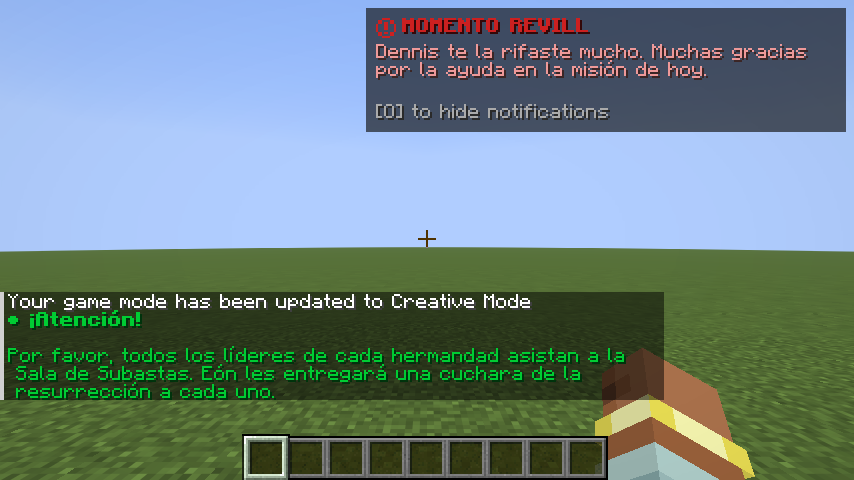

# Server templates

Templates define notification content and channels; presentations define visuals. Servers read `data/`, clients read
`assets/`. Keep server logic in datapacks and visuals in resource packs.

## Create a template

In a datapack compatible with your Minecraft version, create `data/mypack/notify/templates/welcome.json`:

```json
{
  "format_version": 1,
  "channels": ["showcase", "chat"],
  "presentation": "notifymod:motd",
  "placement": "center",
  "priority": "NORMAL",
  "message": "Welcome, {player}",
  "key": "welcome",
  "cooldown": "10s",
  "duration": "6s"
}
```

```mcfunction
/reload
/notify validate
/notify showcase mypack:welcome player=Alex
```

The file path determines its id; an `id` field inside JSON does not override it. Managed files such as
`config/notifymod/managed/templates/mypack/welcome.json` override datapacks after reload.

## Supported fields

| Field | Behavior |
|---|---|
| `format_version` | 1 |
| `channels` | Nonempty list of `chat`, `hud`, `showcase`; defaults to `showcase` |
| `presentation` | Id; defaults to `notifymod:motd` |
| `placement` | Seven placements; defaults to center for Showcase, top-right for HUD |
| `priority` | LOW, NORMAL, HIGH, CRITICAL; CRITICAL always uses center |
| `message` | Required: string, `{"text":"…"}`, or `{"translate":"key","with":["{arg}"]}` |
| `mirror_to_chat` | `true` adds chat |
| `key` | Optional deduplication/cancellation key, up to 64 characters |
| `cooldown` | Delay between template sends through the `showcase` command |
| `duration` | `"6s"` or milliseconds; 500 ms–120 s; loaded visual presentations override this duration |

Arguments are plain text: up to 16 names using `[a-z0-9_]` (1–32 characters) and values up to 256 characters.
Translation keys must exist in clients' resource packs. The shipped `notifymod:restart_warning` uses
`notifymod.restart.warning` with the `minutos` argument.

Template cooldowns apply to command sends; triggers use their own limits. Planned template fields `audience`,
`fallback` and custom permissions are **not interpreted yet**. `message` provides the current fallback when visuals
are missing; use trigger audiences to filter recipients.

For custom visuals, create `assets/mypack/notify/presentations/welcome.json`, reference it in `presentation`, and
distribute its resource pack to every player. See [presentations](presentations.md).

## Chat and text-card style

Chat uses a bold green heading, a blank line and a green body. Text cards use a translucent dark panel,
circular icon, red heading, pink body and a hide-key hint. HUD defaults to `top_right`.
Bind the corner hide key under Options → Controls → Notify Mod. The hint shows the bound key or asks you to bind one.
CRITICAL still goes to the center.

Set `style` in a template; no resource pack is needed:

```json
{
  "format_version": 1,
  "channels": ["hud", "chat"],
  "placement": "top_right",
  "message": "Thank you for helping with today's mission.",
  "duration": "15s",
  "style": {
    "title": "MISSION COMPLETE",
    "chat_color": "#00CC33",
    "title_color": "#CC2020",
    "text_color": "#EE9999",
    "background_color": "#101010",
    "hint_color": "#AAAAAA",
    "background_opacity": 0.65,
    "width": 240,
    "shadow": true,
    "show_icon": true,
    "show_hide_hint": true
  }
}
```

Colors use `#RRGGBB`; opacity accepts 0..1 (0 removes the panel), width 120..480 GUI units.
`title` accepts text or the same `text`/`translate`/`with` object as `message`, with at most 128 characters and four
translation arguments. The default heading is “Attention!”. Omitted fields use the defaults shown above.
Invalid types, colors and unknown style fields fail template validation.
Cards fit their width to the viewport and truncate overflowing messages with a final “…” line.
Chat keeps Minecraft's wrapping, background and scale.

Try the included examples:

```mcfunction
/notify showcase notifymod:styled_chat
/notify showcase notifymod:styled_corner
/notify showcase notifymod:styled_corner message="Another message" chat=true
```

Run `/notify reload` after editing a template. Command overrides for message, duration, priority and placement
preserve its style. Timeline presentations keep their track colors; `style` affects chat and text cards.
The visual protocol is now v2; both server and client need this update for cards.
With `require_client=false`, incompatible clients receive vanilla chat fallback.


