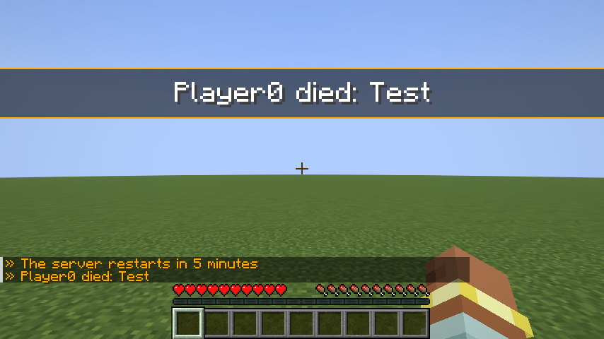
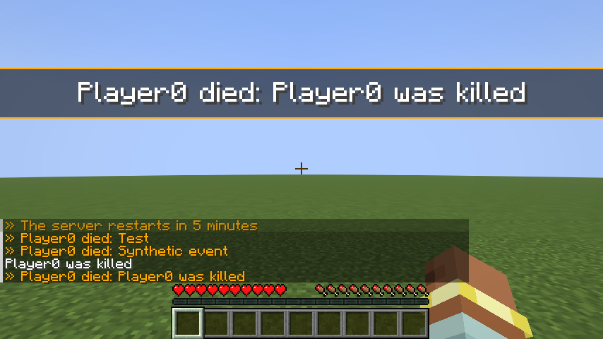

# Triggers

Triggers connect server events to existing notification templates. They are disabled by default. This implements
the framework and initial events; **phase 4 and the full project plan remain incomplete**.

## Quick start

Run in-game with OP 3:

```mcfunction
/notify trigger list
/notify trigger test notifymod:player_death
/notify trigger enable notifymod:player_death
/notify trigger set notifymod:player_death cooldown 30s
/notify trigger audience notifymod:player_death
/notify trigger disable notifymod:player_death
```

`test` previews only on the command executor, without killing anyone, including disabled triggers. From console,
use `execute as <player> run notify trigger test <id>`. `fire` respects enablement, filters and limits.
Unqualified ids use `notifymod:`. `info` describes the definition; `set` also accepts `per_player_cooldown`,
`max_per_minute`, `placement` and `priority`.

## Files

Datapacks use `data/<namespace>/notify/triggers/<name>.json`; managed definitions in
`config/notifymod/managed/triggers/<namespace>/<name>.json` override datapacks. Reload using `/reload` or
`/notify reload`; `/notify validate` and `trigger list` report errors. Runtime overrides are saved atomically on
a dedicated executor to `config/notifymod/triggers_state.json`; corrupt state gets a `.bak` copy.
Audit entries go to `audit.jsonl`, rotating to `audit.previous.jsonl` above 4 MiB.

See the shipped [death trigger](https://github.com/AloneX15/Notify-Mod/blob/main/src/main/resources/data/notifymod/notify/triggers/player_death.json) for a complete
example. Its `template` must reference an existing server template. Unknown fields and unsupported features fail closed.

## Definition fields

| Field | Default | Rule |
|---|---|---|
| `format_version` | Required | Integer `1` |
| `type` | `manual` | A supported event type |
| `enabled` | `false` | Boolean; persistent state may override it |
| `template` | Required | Existing server template, qualified id |
| `placement`, `priority` | Template values | Override; CRITICAL still uses center |
| `args` | Empty | Up to 16 literals or event variables |
| `conditions` | Empty | All conditions must match |
| `audience.include` | Everyone | Union; an empty list selects nobody |
| `audience.exclude` | Empty | Subtract recipients after includes |
| `cause_delivery` | `after_respawn` | `after_respawn`, `skip`, or `immediate` depending on event type |
| `cooldown`, `per_player_cooldown` | `0` | 0–24 hours, per trigger and event player |
| `max_per_minute` | `6` | Integer 1–120 |
| `allow_coordinates` | `false` | Permit `$x`, `$y`, `$z` |
| `_comment` | Empty | Optional comment |
| `id` | File path | JSON does not override the effective id |

Persistent state overrides definitions on reload. `set` accepts `enabled`, `cooldown`, `per_player_cooldown`,
`max_per_minute`, `placement`, `priority`; it neither creates definitions nor edits audiences. Edit JSON and reload
for those changes. `info` describes configuration; a callback failure can disable execution for the session even
while the configured value remains `enabled=true`, so inspect the log.

## Supported features

- Events: `player_death`, `player_respawn`, `player_join`, `player_leave`, `chat_keyword`, `server_ready`,
  `server_stopping`, `manual`. Keywords match the entire message, case-insensitively, using `conditions.keyword`.
- Conditions: `dimension`, `damage_type`, `killer_type`, `cause_permission`, `cause_group`, `keyword`.
  Conditions combine with AND; each value list combines with OR.
- Audiences: `all`, `involved` (event player), `team`, `dimension`, `permission`, `group`. Includes form a union;
  excludes are subtracted. Empty includes select nobody. Rules accept `{"type":"team","value":"staff"}` or
  `{"team":"staff"}`. Groups require LuckPerms; missing LuckPerms selects nobody and logs a warning.
- Variables: `$player`, `$killer`, `$death_message`, `$dimension`, `$time`; `$x`, `$y`, `$z` require
  `allow_coordinates: true`. Values are sanitized and truncated to 256 characters.
- Limits: 1024 definitions, 32 rules per audience list, 16 arguments, cooldowns up to 24 hours, 1–120 events per
  minute per trigger (default 6), and 20 accepted trigger executions per second globally (each can have multiple recipients).
- Death delivery: `after_respawn` defers up to 16 notifications for 60 seconds; `skip` omits the event player.
  `immediate` is rejected for death events. On respawn, activation, audiences and permissions are rechecked.
  Disconnect, disable and reload clear affected pending deliveries. Previewing a living player does not defer.

Permission rules accept namespaced or dotted notation. LuckPerms maps namespaces to dots as documented by its
[Fabric adapter](https://github.com/LuckPerms/LuckPerms/blob/master/fabric/src/main/java/me/lucko/luckperms/fabric/listeners/FabricPermissionsApiV1Listener.java).
The LuckPerms integration **has not been verified on a LuckPerms server**.

Hooks install only when an event type is first enabled. Fabric has no unregister API, so disabled hooks retain a
constant-time guard. Event processing errors disable only the affected trigger until edited or reloaded.

## Permissions and tests

General access requires `notifymod.command` (OP 2). `notifymod.trigger.list` and `.info` default to OP 2;
`.manage`, `.test` and `.fire` to OP 3. `audience` uses `.info`. Commands use the configured per-player rate limit.
Delivery respects channel permissions, `notifymod.receive.<namespace>.<template>`, and
`notifymod.bypass.trigger.<namespace>.<trigger>` (the latter is not granted by OP).

Unit tests cover parsing, coordinate privacy, cooldowns, burst limits and namespaced arguments. Server gametests
check default activation, commands and denial of management with OP 2. The client test checks preview, synthetic
enabled/disabled delivery and an actual death/respawn cycle, producing screenshots of both cases. LuckPerms still
needs an integration test.





## Remaining scope

Remaining catalog A events, polling catalog B, catalog C, coalescing, tags/hardcore/chance filters,
selectors/radius/killer audiences, prefix/suffix metadata, impersonated tests and per-id firing permissions remain.
The admin UI, public API, variables, full polish, reference pack, 1.0 release and scenes remain pending.
This initial wiki documents available features; it does not complete the entire phase 8.
